## Hi there 👋

<h3 align="left">Languages and Tools:</h3>

  <!-- 🟦 Languages -->
  
  
  
  
  
  <!-- 🧱 Frameworks / Libraries -->
  
  
  
  <!-- 🗄️ Database & Messaging -->
  
  
  <!-- ☁️ Cloud & Platform -->
  
  
  <!-- ⚙️ DevOps / Tools -->
  

<h3 align="left">Stats:</h3>
  
  &nbsp;&nbsp;&nbsp;
  

<picture style="display: block; margin-left: 0;">
  <source media="(prefers-color-scheme: dark)" srcset="https://raw.githubusercontent.com/0x6Ain/0x6Ain/output/github-contribution-grid-snake-dark.svg">
  
  <source media="(prefers-color-scheme: light)" srcset="https://raw.githubusercontent.com/0x6Ain/0x6Ain/output/github-contribution-grid-snake.svg">

  
</picture>